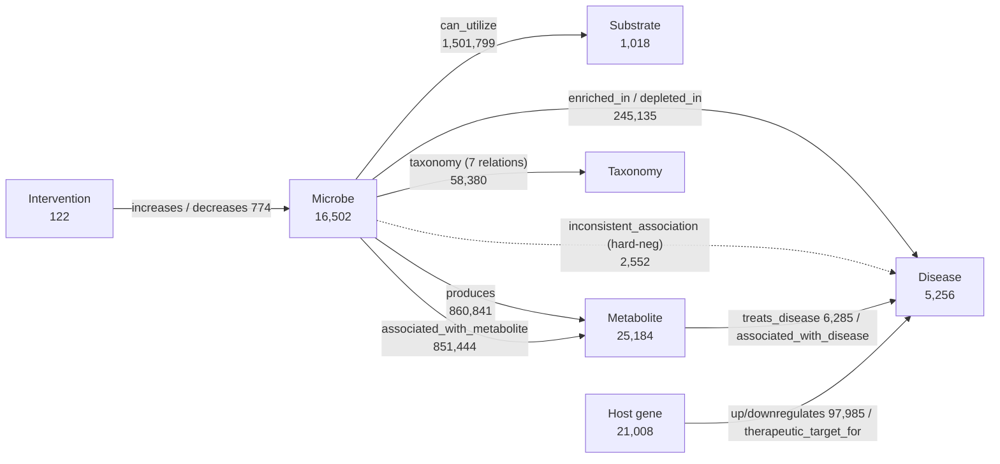

# MicrobeKG — a benchmark-ready multi-relational microbiome knowledge graph


**MicrobeKG** is a microbiome-centered, multi-relational knowledge graph and a
**knowledge-graph-completion (KGC) benchmark** for microbe–disease reasoning. It
connects microbes, substrates, metabolites, diseases, host genes, and
interventions in a single evidence-annotated graph, and ships with standardized,
leakage-audited train/valid/test splits plus a full baseline leaderboard.

It is built to test **more than link-prediction accuracy**: cold-start
generalization, capacity-to-realization transfer, hard-negative discrimination,
and mechanism-aware substrate→disease discovery.

> **Full data package** (KG + all splits, ~1.9 GB):
> [download from Google Drive](https://drive.google.com/drive/folders/1i7yKim-T6zOjaCGMW6Qws-q_QIS-_9rR?usp=drive_link).
> This repository holds the dataset card, documentation, benchmark code, and
> aggregated results. A versioned Zenodo DOI will be added for the archival release.

---

## Background

Existing microbiome knowledge resources serve complementary purposes.
MetagenomicKG and KG-Microbe emphasize broad taxonomic, functional, and trait
integration; MGMLink and MicrobiomeKG support mechanistic hypothesis generation
and literature-derived biomedical queries. Their node and edge counts therefore
reflect different source scopes, ontology expansion strategies, and background
biomedical content, and should not be interpreted as a direct ranking of
resource quality.

Microbe–disease prediction, however, is still commonly evaluated on small
bipartite association matrices. HMDAD contains 292 microbes, 39 diseases, and
450 deduplicated associations, while a widely used Disbiome benchmark subset
contains 1,582 microbes, 352 diseases, and 8,645 associations. Such datasets are
valuable curated references but do not test multi-relational reasoning,
inductive generalization, hard-negative discrimination, or resistance to
graph-derived leakage. MicrobeKG was designed to make these properties explicit:
it places 16,502 microbes and 5,256 diseases in a 25-relation,
evidence-annotated graph and releases fixed train/valid/test splits, cold-start
settings, leakage audits, and a 13-model leaderboard under seed 42.

| Resource | Nodes | Edges / records | Microbial entities | Primary scope | Multi-relational | Microbe–disease content | Edge provenance | Standard KGC splits | Cold-start evaluation | Explicit hard negatives | Leakage audit | Baseline leaderboard |
|---|---:|---:|---:|---|:---:|:---:|:---:|:---:|:---:|:---:|:---:|:---:|
| **MicrobeKG v3.3** | **69,090** | **3,687,015** | **16,502** | Evidence-typed microbe–host–disease KGC benchmark | ✓ | ✓ | ✓ | ✓ | ✓ | ✓ | ✓ | ✓ |
| [MetagenomicKG](https://pmc.ncbi.nlm.nih.gov/articles/PMC10980061/) | 1.25 M | 56 M | GTDB-centered | Taxonomic and metagenomic functional integration | ✓ | ✓ | ✓ | ✗ | ✗ | ✗ | ✗ | ✗ |
| [MGMLink](https://www.nature.com/articles/s41598-025-91230-6) | 782,466 | 5,076,297 | 533 taxa | Mechanistic microbe–disease hypothesis generation | ✓ | ✓ | ✓ | ✗ | ✗ | ✗ | ✗ | ✗ |
| [MicrobiomeKG v2.1](https://www.frontiersin.org/journals/systems-biology/articles/10.3389/fsysb.2025.1544432/full) | 27,772 | 112,118 | 1,593 organism-taxon nodes | Literature-derived assertions and Translator queries | ✓ | ✓ | ✓ | ✗ | ✗ | ✗ | ✗ | ✗ |
| [KG-Microbe](https://kghub.org/kg-registry/resource/kg-microbe/kg-microbe.html) | Modular | Modular | Configurable bacterial/archaeal subsets | Microbial traits, taxonomy, chemistry, and environment | ✓ | ✗ | ✓ | ✗ | ✗ | ✗ | ✗ | ✗ |
| [HMDAD benchmark](https://pmc.ncbi.nlm.nih.gov/articles/PMC3965058/) | 331 entities | 450 associations | 292 microbes | Curated bipartite microbe–disease associations | ✗ | ✓ | ✓ | ✗ | ✗ | ✗ | ✗ | ✗ |
| [Disbiome benchmark subset](https://pmc.ncbi.nlm.nih.gov/articles/PMC11443509/) | 1,934 entities | 8,645 associations | 1,582 microbes | Curated bipartite microbe–disease associations | ✗ | ✓ | ✓ | ✗ | ✗ | ✗ | ✗ | ✗ |

*Counts are release-specific and are not fully commensurate across resources.
Here, ✓ means that the cited release explicitly provides the feature; ✗ means
that it is not provided as a release feature, rather than proving that the
underlying resource could not support it.*

## What you get

| | |
|---|---|
| **Multi-relational KG** | 25 relations × 6 node types, evidence-annotated, ~3.69 M edges |
| **4 benchmark tasks** | microbe→disease, capacity→realization, substrate→disease discovery, metabolite→disease therapy |
| **Baseline leaderboard** | 13 baselines (8 KGE/GNN + 3 structural heuristics + 2 trivial floors) across 182 model×setting cells |
| **Robustness + ablation** | negative-ratio robustness of every discrimination set; multi-relation (±bridge) ablation |

---

## Dataset card

| Field | Value |
|---|---:|
| KG version | v3.3 |
| Total nodes | 69,090 |
| Total edges | 3,687,015 |
| Node types | 6 |
| Relation types | 25 |
| Source databases / resources | 19 |
| Largest connected component | 68,382 nodes |
| Hard-negative pool | 2,715 edges (`inconsistent_association` 2,552 + `does_not_utilize` 146 + `does_not_produce` 17) |
| Benchmark tasks | 4 (all leaderboard cells use seed 42) |
| Split package size | ~1.9 GB |
| Edge schema | 10 columns, evidence-aware (see [DATA.md](DATA.md)) |

## Graph at a glance



Full node, relation, source, and evidence inventories are in **[DATA.md](DATA.md)**.

---

## Repository layout

```text
README.md          # this file — overview + dataset card
DATA.md            # data sources (19), node/relation inventory (6/25), schema, IDs, evidence
BENCHMARK.md       # the 4 tasks and their split designs (leakage protection, tax-proximity)
RESULTS.md         # baseline leaderboard (full metrics) + robustness + multi-relation ablation
figures/           # figures referenced by the docs (robustness.png, ...)
splits/            # split-design READMEs; full train/valid/test TSVs are in the data package
experiments/       # benchmark code (run.py per task), raw results, and aggregation scripts
  leaderboard/     #   aggregated leaderboard.md/.csv, robustness.*, ablation_multirelation.*
kg_build/          # KG build reports (kg_build/reports/final_kg_report.txt is authoritative)
```

## Quickstart

1. Clone this repository for the dataset card, documentation, and benchmark code.
2. Download the full KG + `splits/` package (~1.9 GB) from the release link.
3. Place `splits/` at the repository root (next to `experiments/`).
4. Train/evaluate one cell — e.g. Task 1, transductive, RotatE, seed 42:

   ```bash
   python experiments/task1/run.py --model RotatE --setting transductive --seed 42
   ```

   Each split TSV is the standard 10-column edge format, directly loadable into
   PyKEEN / PyG / DGL pipelines. `experiments/run_all.py` drives the full sweep
   (resumable); `experiments/aggregate.py` rebuilds the leaderboard.

## Results preview

- **RotatE leads ranking** on every task ceiling; **structural heuristics match or
  beat KGE on honest cold-start / zero-shot splits** (e.g. Task 1 cold-microbe,
  Task 3-B).
- On the **hard-negative discrimination sets, models collapse** — AUROC near or
  below 0.5 on Task 1/2 (the Gap-1 evidence): a model can rank standard links but
  cannot tell a contradictory association from a clean one.
- A negative-ratio robustness analysis shows the high "0.9x" AUPRC on these sets
  is a **prevalence floor artifact** (AUROC is ratio-invariant).

Full tables, figures, and the per-cell leaderboard are in **[RESULTS.md](RESULTS.md)**.

---

## Documentation

| Document | Contents |
|---|---|
| [DATA.md](DATA.md) | Sources, node/relation inventory, edge schema, ID conventions, evidence types |
| [BENCHMARK.md](BENCHMARK.md) | The 4 tasks, split rules, leakage protection, recommended metrics |
| [RESULTS.md](RESULTS.md) | Baseline leaderboard, negative-ratio robustness, multi-relation ablation |

## Citation & license

A formal citation and dataset license will be supplied by the dataset owners
before public release. Please cite the accompanying resource paper when using
MicrobeKG.
