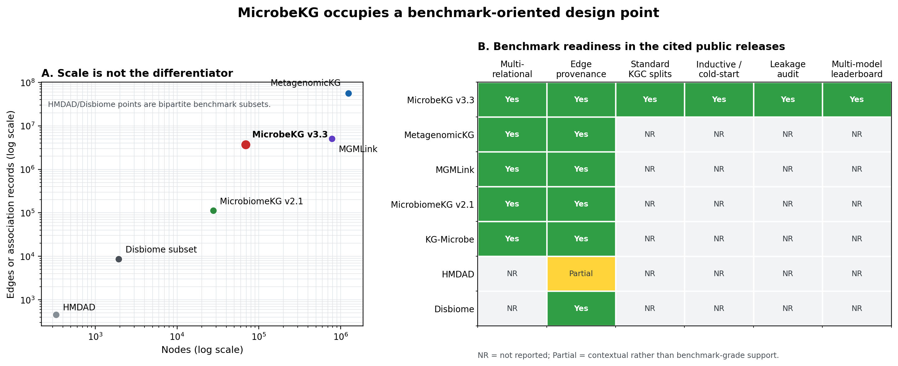
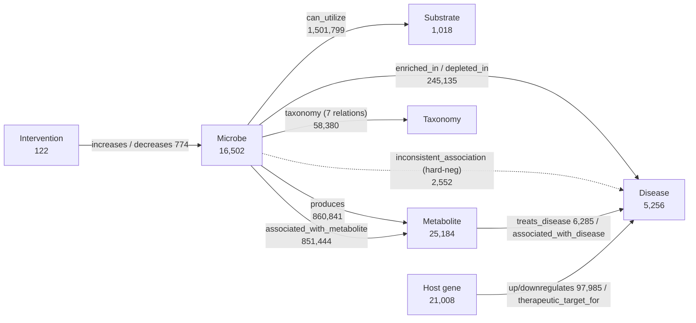

# MicrobeKG — a benchmark-ready multi-relational microbiome knowledge graph


**MicrobeKG** is a microbiome-centered, multi-relational knowledge graph and a
**knowledge-graph-completion (KGC) benchmark** for microbe–disease reasoning. It
connects microbes, substrates, metabolites, diseases, host genes, and
interventions in a single evidence-annotated graph, and ships with standardized,
leakage-audited train/valid/test splits plus a full baseline leaderboard.

It is built to test **more than link-prediction accuracy**: cold-start
generalization, capacity-to-realization transfer, hard-negative discrimination,
and mechanism-aware substrate→disease discovery.

> **Full data package** (KG + all splits, ~1.9 GB):
> [download from Google Drive](https://drive.google.com/drive/folders/1i7yKim-T6zOjaCGMW6Qws-q_QIS-_9rR?usp=drive_link).
> This repository holds the dataset card, documentation, benchmark code, and
> aggregated results. A versioned Zenodo DOI will be added for the archival release.

---

## Why MicrobeKG exists — a benchmark gap, not a size claim

Microbiome knowledge graphs have been built for different scientific purposes,
so raw node or edge counts are not a meaningful ranking by themselves.
[MetagenomicKG](https://pmc.ncbi.nlm.nih.gov/articles/PMC10980061/) is larger
because it integrates broad taxonomic and functional resources, while
[MGMLink](https://www.nature.com/articles/s41598-025-91230-6) inherits a large
general biomedical substrate to support mechanistic path search. MicrobeKG does
**not** claim to be the largest microbiome KG. It addresses a different design
objective: a disease-centered graph that can be evaluated as a controlled,
reproducible KGC benchmark.

The resource closes three linked methodological gaps:

1. **Scale and structure mismatch in existing prediction benchmarks.** Common
   microbe–disease benchmarks reduce the problem to a single bipartite
   association matrix: HMDAD contains 292 microbes, 39 diseases, and 450
   deduplicated associations; a widely used Disbiome subset contains 1,582
   microbes, 352 diseases, and 8,645 associations. MicrobeKG instead exposes an
   **86.7 million-pair microbe × disease hypothesis space** (16,502 × 5,256)
   inside a 25-relation graph. That space is approximately **7,600× HMDAD** and
   **156× the Disbiome subset**, before accounting for substrates, metabolites,
   host genes, interventions, and explicit hard negatives.
2. **Resource availability without benchmark specification.** Existing
   microbiome KGs primarily support integration, querying, or hypothesis
   generation. Among the public releases compared below, MicrobeKG is the only
   one that jointly provides fixed train/valid/test files, transductive and
   cold-start settings, hard-negative evaluation, and a 13-model leaderboard.
   All reported benchmark cells use **seed 42**.
3. **Evaluation without shortcut auditing.** MicrobeKG treats leakage control as
   part of the dataset specification. Pair-level duplicates, inverse relations,
   taxonomy/ontology closure, and 2–3-hop mechanistic shortcuts are audited or
   removed per task; taxonomy-proximity strata (`genus / family / none`) then
   quantify how much apparent generalization can be explained by copying from
   nearby taxa.

### Positioning against related microbiome resources

| Resource | Nodes | Edges / records | Microbial layer | Primary design objective | Standard KGC splits / cold-start / leakage audit |
|---|---:|---:|---:|---|---|
| **MicrobeKG v3.3** | **69,090** | **3,687,015** | **16,502 microbes** | Disease-centered, evidence-typed KGC benchmark | **Yes / Yes / Yes** |
| MetagenomicKG | 1.25 M | 56 M | GTDB-centered | Taxonomic and metagenomic functional integration | Not reported |
| MGMLink | 782,466 | 5,076,297 | 533 microbial taxa | Mechanistic path search for microbe–disease hypotheses | Not reported |
| MicrobiomeKG v2.1 | 27,772 | 112,118 | 1,593 organism-taxon nodes | Literature-table integration and Translator queries | Not reported |
| KG-Microbe | Modular; graph-dependent | Modular; graph-dependent | Customizable bacterial/archaeal subsets | Traits, taxonomy, chemistry, and environment integration | Not reported |
| HMDAD benchmark | 331 entities | 450 associations | 292 microbes | Curated bipartite microbe–disease association matrix | No / No / No |
| Disbiome benchmark subset | 1,934 entities | 8,645 associations | 1,582 microbes | Curated bipartite microbe–disease association matrix | No / No / No |



*Counts are release-specific and not perfectly commensurate: ontology expansion,
duplicate assertions, and background biomedical content differ across graphs.
Sources: [MetagenomicKG](https://pmc.ncbi.nlm.nih.gov/articles/PMC10980061/),
[MGMLink](https://www.nature.com/articles/s41598-025-91230-6),
[MicrobiomeKG v2.1](https://www.frontiersin.org/journals/systems-biology/articles/10.3389/fsysb.2025.1544432/full),
[KG-Microbe registry](https://kghub.org/kg-registry/resource/kg-microbe/kg-microbe.html),
and the [HMDAD/Disbiome benchmark summary](https://pmc.ncbi.nlm.nih.gov/articles/PMC11443509/).
The figure is reproducible with `python scripts/plot_kg_landscape.py`.*

## What you get

| | |
|---|---|
| **Multi-relational KG** | 25 relations × 6 node types, evidence-annotated, ~3.69 M edges |
| **4 benchmark tasks** | microbe→disease, capacity→realization, substrate→disease discovery, metabolite→disease therapy |
| **Baseline leaderboard** | 13 baselines (8 KGE/GNN + 3 structural heuristics + 2 trivial floors) across 182 model×setting cells |
| **Robustness + ablation** | negative-ratio robustness of every discrimination set; multi-relation (±bridge) ablation |

---

## Dataset card

| Field | Value |
|---|---:|
| KG version | v3.3 |
| Total nodes | 69,090 |
| Total edges | 3,687,015 |
| Node types | 6 |
| Relation types | 25 |
| Source databases / resources | 19 |
| Largest connected component | 68,382 nodes |
| Hard-negative pool | 2,715 edges (`inconsistent_association` 2,552 + `does_not_utilize` 146 + `does_not_produce` 17) |
| Benchmark tasks | 4 (all leaderboard cells use seed 42) |
| Split package size | ~1.9 GB |
| Edge schema | 10 columns, evidence-aware (see [DATA.md](DATA.md)) |

## Graph at a glance



Full node, relation, source, and evidence inventories are in **[DATA.md](DATA.md)**.

---

## Repository layout

```text
README.md          # this file — overview + dataset card
DATA.md            # data sources (19), node/relation inventory (6/25), schema, IDs, evidence
BENCHMARK.md       # the 4 tasks and their split designs (leakage protection, tax-proximity)
RESULTS.md         # baseline leaderboard (full metrics) + robustness + multi-relation ablation
figures/           # figures referenced by the docs (robustness.png, ...)
splits/            # split-design READMEs; full train/valid/test TSVs are in the data package
experiments/       # benchmark code (run.py per task), raw results, and aggregation scripts
  leaderboard/     #   aggregated leaderboard.md/.csv, robustness.*, ablation_multirelation.*
kg_build/          # KG build reports (kg_build/reports/final_kg_report.txt is authoritative)
```

## Quickstart

1. Clone this repository for the dataset card, documentation, and benchmark code.
2. Download the full KG + `splits/` package (~1.9 GB) from the release link.
3. Place `splits/` at the repository root (next to `experiments/`).
4. Train/evaluate one cell — e.g. Task 1, transductive, RotatE, seed 42:

   ```bash
   python experiments/task1/run.py --model RotatE --setting transductive --seed 42
   ```

   Each split TSV is the standard 10-column edge format, directly loadable into
   PyKEEN / PyG / DGL pipelines. `experiments/run_all.py` drives the full sweep
   (resumable); `experiments/aggregate.py` rebuilds the leaderboard.

## Results preview

- **RotatE leads ranking** on every task ceiling; **structural heuristics match or
  beat KGE on honest cold-start / zero-shot splits** (e.g. Task 1 cold-microbe,
  Task 3-B).
- On the **hard-negative discrimination sets, models collapse** — AUROC near or
  below 0.5 on Task 1/2 (the Gap-1 evidence): a model can rank standard links but
  cannot tell a contradictory association from a clean one.
- A negative-ratio robustness analysis shows the high "0.9x" AUPRC on these sets
  is a **prevalence floor artifact** (AUROC is ratio-invariant).

Full tables, figures, and the per-cell leaderboard are in **[RESULTS.md](RESULTS.md)**.

---

## Documentation

| Document | Contents |
|---|---|
| [DATA.md](DATA.md) | Sources, node/relation inventory, edge schema, ID conventions, evidence types |
| [BENCHMARK.md](BENCHMARK.md) | The 4 tasks, split rules, leakage protection, recommended metrics |
| [RESULTS.md](RESULTS.md) | Baseline leaderboard, negative-ratio robustness, multi-relation ablation |

## Citation & license

A formal citation and dataset license will be supplied by the dataset owners
before public release. Please cite the accompanying resource paper when using
MicrobeKG.
