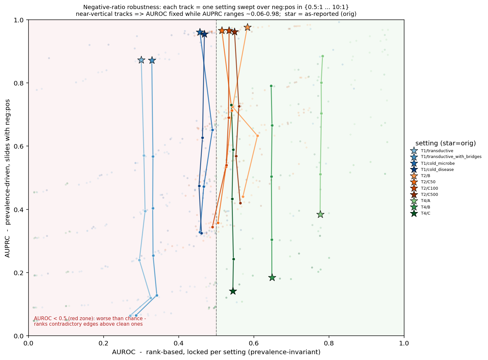

# MicrobeKG — Baseline Results

A reproducible baseline leaderboard across all four tasks, plus a negative-ratio
robustness analysis and a multi-relation ablation. Aggregation is offline and
re-runnable: `experiments/aggregate.py`, `experiments/analyze_robustness.py`,
`experiments/ablation_multirelation.py`. Full per-cell tables are in
`experiments/leaderboard/`.

## Setup

- **13 baselines** — KGE: TransE, DistMult, ComplEx, RotatE, PairRE, ConvE,
  TuckER; GNN: RGCN; structural heuristics: CN, RA, L3; trivial floors: Random,
  Popularity.
- **Single seed (42)**, **165 model × setting cells** populated.
- **Ranking** — full filtered rank over the same-type candidate pool, both
  directions, micro **and** macro, MRR + Hits@{1,3,5,10,20} + 95% bootstrap CI.
- **Discrimination** — hard-negative AUPRC (+ prevalence floor + fold-enrichment)
  and AUROC (+ CI), plus `fpr@median`.
- Heavy models (ConvE/TuckER/RGCN) are skipped on selected 3.6 M-edge settings
  by policy.

## Headline findings

1. **RotatE leads ranking** on every task ceiling (T1-transductive, T2-A, T3-A,
   T4-A — first in all four).
2. **On honest cold-start / zero-shot splits, structural heuristics match or beat
   KGE.** T1 cold-microbe: L3 > all KGE; T3-B: RA/L3/CN are the top three; T2-B:
   CN/RA (AUROC 0.75) > best KGE TransE (0.62). KGC has **no advantage** on the
   honest splits — the central anti-inflation result.
3. **Models collapse on hard negatives.** On T1/T2 the discrimination AUROC is
   near or **below 0.5** (PairRE 0.035, ComplEx 0.15): a model ranks standard
   links but scores a *contradictory* association **above** a clean one — driven
   by degree/popularity (Popularity's own AUROC is 0.30, also inverted).
4. **The "0.9x AUPRC" on T1/T2 is a floor artifact**, not skill — see robustness.
5. **Honesty flags:** T1 cold-disease collapses to ≈Random (hardest setting,
   headroom); ConvE did not converge on the big graphs (`best_epoch ≤ 25`).

---

## Ranking — task ceilings (both-MRR, micro)

Each task's strongest setting; one model per row, four tasks across.
(`-` = skipped by policy on big graphs.)

| Model | type | T1 transductive | T2-A capacity | T3-A recovery | T4-A treats |
|---|---|--:|--:|--:|--:|
| RotatE | kge | **0.1225** | **0.7491** | **0.4465** | **0.0872** |
| RGCN | kge | 0.1067 | 0.7204 | – | – |
| TuckER | kge | 0.0948 | 0.4844 | – | – |
| PairRE | kge | 0.0823 | 0.6294 | 0.4096 | 0.0553 |
| TransE | kge | 0.0657 | 0.6247 | 0.3943 | 0.0594 |
| ConvE | kge | 0.0642 | 0.1045 ⚠ | – | – |
| DistMult | kge | 0.0631 | 0.4415 | 0.1753 | 0.0424 |
| ComplEx | kge | 0.0357 | 0.5628 | 0.2636 | 0.0717 |
| L3 | structural | 0.1012 | 0.5006 | 0.3370 | 0.0470 |
| RA | structural | 0.0550 | 0.0381 | 0.2304 | 0.0551 |
| CN | structural | 0.0517 | 0.0381 | 0.2078 | 0.0500 |
| Popularity | trivial | 0.0864 | 0.4269 | 0.1812 | 0.0196 |
| Random | trivial | 0.0086 | 0.0458 | 0.0682 | 0.0092 |

⚠ ConvE did not converge on T2-A. CN/RA collapse on T2-A (pure bipartite
`can_utilize`, common-neighbor = 0); L3 (3-hop) recovers to 0.50.

### Metric depth (example: T1 transductive ranking)

Every setting is reported at this depth (CIs and all Hits in
`experiments/leaderboard/ranking.csv`):

| Model | type | MRR | MRR 95%CI | MRR(macro) | gap | H@1 | H@3 | H@5 | H@10 | H@20 |
|---|---|--:|--|--:|--:|--:|--:|--:|--:|--:|
| RotatE | kge | 0.1225 | 0.118–0.127 | 0.1955 | −0.073 | 0.0600 | 0.1220 | 0.1673 | 0.2457 | 0.3473 |
| RGCN | kge | 0.1067 | 0.103–0.111 | 0.1732 | −0.067 | 0.0447 | 0.1065 | 0.1499 | 0.2299 | 0.3318 |
| L3 | structural | 0.1012 | 0.097–0.105 | 0.1810 | −0.080 | 0.0386 | 0.1059 | 0.1530 | 0.2262 | 0.3125 |
| TuckER | kge | 0.0948 | 0.091–0.099 | 0.1620 | −0.067 | 0.0400 | 0.0965 | 0.1366 | 0.2033 | 0.2850 |
| Popularity | trivial | 0.0864 | 0.083–0.090 | 0.1430 | −0.057 | 0.0369 | 0.0818 | 0.1191 | 0.1875 | 0.2645 |
| PairRE | kge | 0.0823 | 0.079–0.086 | 0.1208 | −0.039 | 0.0311 | 0.0768 | 0.1157 | 0.1798 | 0.2712 |
| TransE | kge | 0.0657 | 0.063–0.069 | 0.1151 | −0.050 | 0.0230 | 0.0537 | 0.0853 | 0.1483 | 0.2372 |
| ConvE | kge | 0.0642 | 0.061–0.067 | 0.1091 | −0.045 | 0.0250 | 0.0572 | 0.0837 | 0.1353 | 0.2149 |
| DistMult | kge | 0.0631 | 0.060–0.066 | 0.1178 | −0.055 | 0.0192 | 0.0569 | 0.0876 | 0.1440 | 0.2203 |
| RA | structural | 0.0550 | 0.052–0.058 | 0.0813 | −0.026 | 0.0204 | 0.0518 | 0.0749 | 0.1182 | 0.1786 |
| CN | structural | 0.0517 | 0.049–0.055 | 0.0706 | −0.019 | 0.0164 | 0.0466 | 0.0692 | 0.1133 | 0.1717 |
| ComplEx | kge | 0.0357 | 0.034–0.038 | 0.0417 | −0.006 | 0.0088 | 0.0250 | 0.0398 | 0.0765 | 0.1331 |
| Random | trivial | 0.0086 | 0.008–0.009 | 0.0133 | −0.005 | 0.0014 | 0.0036 | 0.0070 | 0.0135 | 0.0251 |

---

## Hard-negative discrimination

The metric **flips by set**: positive-heavy sets (T1/T2) read **AUROC**;
negative-heavy sets (T4) read **AUPRC over floor**.

| Set | n+ : n− | primary | best (non-trivial) | Random | reading |
|---|---|---|---|--:|---|
| T1 transductive | 5531 : 504 | AUROC | DistMult **0.459** | 0.500 | all < 0.5 → KGE scores hard-neg **higher** (inverted) |
| T2-B cross-relation | 2329 : 81 | AUROC | CN **0.750** | 0.511 | heuristics catch it; KGE only 0.54–0.64 |
| T4-A treats | 629 : 6290 | AUPRC | PairRE **0.666** (7.3× floor) | 0.085 | KGE strongly separates (AUROC 0.94) |
| T4-B cross-evidence | 6279 : 62850 | AUPRC | DistMult **0.512** (5.6× floor) | 0.090 | KGE strongly separates (AUROC 0.95) |

---

## Negative-ratio robustness

Each discrimination set's raw pos/neg score arrays are resampled offline to
different neg:pos ratios. **AUROC is near-flat across ratios (rank-based,
prevalence-invariant — the real signal); AUPRC slides with prevalence.** So the
high "orig" AUPRC on the positive-heavy T1/T2 sets is a *floor artifact*.

*Each track = one setting swept over neg:pos ∈ {0.5:1 … 10:1}; near-vertical
tracks ⇒ AUROC is locked while AUPRC ranges ~0.06–0.98. ★ = as-reported (orig).
Red zone = AUROC < 0.5 (worse than chance).*

Median-over-models, two contrasting sets (full table:
`experiments/leaderboard/robustness.md`):

| Set | metric | orig | 1:1 | 10:1 |
|---|---|--:|--:|--:|
| T1 transductive (pos-heavy) | AUROC | 0.300 | 0.311 | 0.271 |
| | AUPRC | 0.873 | 0.394 | 0.064 |
| T4-A (neg-heavy) | AUROC | 0.777 | 0.779 | 0.777 |
| | AUPRC | 0.384 | 0.801 | 0.384 |

AUROC barely moves; AUPRC swings by an order of magnitude with the ratio.

---

## Multi-relation ablation (Task 1, same test set)

Does the multi-relational structure help? T1 has a clean ±bridge ablation:
identical test (5,531), train graph **120,868** edges (microbe-disease only) vs
**3,675,029** edges (+ substrate/metabolite/gene bridges).

| Model | MRR only | MRR +bridge | ΔMRR | AUROC only | AUROC +bridge | ΔAUROC |
|---|--:|--:|--:|--:|--:|--:|
| TransE | 0.0657 | 0.0517 | −0.014 | 0.349 | **0.751** | **+0.402** |
| ConvE | 0.0642 | 0.0382 | −0.026 | 0.186 | 0.375 | +0.189 |
| ComplEx | 0.0357 | 0.0808 | +0.045 | 0.152 | 0.347 | +0.195 |
| RotatE | 0.1225 | 0.0815 | −0.041 | 0.285 | 0.301 | +0.017 |
| DistMult | 0.0631 | 0.0602 | −0.003 | 0.459 | 0.127 | **−0.333** |
| L3 | 0.1012 | 0.0887 | −0.013 | 0.196 | 0.208 | +0.012 |

(Full 13-model table: `experiments/leaderboard/ablation_multirelation.md`.)

**Bridges are not a free lunch — the effect is bidirectional.** Adding the
multi-relational bridges **dilutes ranking** (ΔMRR < 0 for 11/13 models) but, for
path-additive KGE like **TransE, flips hard-negative discrimination from inverted
(0.35) to strong (0.75)** — while a bilinear model like DistMult *degrades*. The
value of "multi-relation" is **discrimination reliability and substrate→disease
reachability, not a ranking bump.**

---

## Reading the metrics

- **AUROC is the primary discrimination metric on positive-heavy sets** (T1, T2):
  AUPRC there is pinned to a 0.92–0.97 prevalence floor and is uninformative
  (Random ≈ best model ≈ floor).
- **AUPRC-over-floor is primary on negative-heavy sets** (T4): the floor is 0.09,
  so fold-enrichment is meaningful (up to 7×).
- Always report `n+ : n−`. The robustness figure is the formal justification.

## Coverage & known gaps

| Item | Status |
|---|---|
| Model × setting cells | **165** populated (single seed 42) |
| TuckER | T1 transductive/cold-start and all T2 settings populated |
| ConvE | did not converge on big graphs (`best_epoch ≤ 25`) — flagged |
| Multi-seed | Task 1 transductive ships 5 seeds; leaderboard is seed 42 |
| Task 3 (S,D) genuine-discovery scoring | **TODO** — data ready (`downstream_sd_test.tsv`, 18,499 genuine); needs the composition evaluation |
| Tax-proximity `none`-layer stratification | **TODO** — `*_proximity.tsv` + raw ranks ready; offline recompute |
| Chemical-class stratification (Task 4-C) | TODO (needs ChEBI/ClassyFire) |

All raw per-instance dumps are in `experiments/<task>/results/raw/*.npz`, so the
TODO stratified/discovery metrics are recomputable **without re-running the sweep**.
